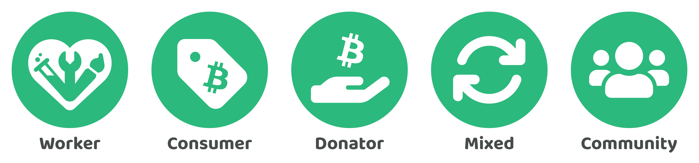

# Ownership

Contributionism advocates for organisations that are collectively owned by those that contribute towards an organisation or by the community that is affected by the organisation.

## Ownership approaches

The adopted ownership approach will determine who receives governance rights in the organisation. Governance rights give people influence and control over how an organisation is operated. Organisations are owned either by a community or by those that contribute towards the organisation. Organisations owned by those that contribute could adopt a donator, worker, consumer or mixed contribution ownership model.

<figure><figcaption></figcaption></figure>

**Worker ownership**

Worker owned organisations are those that are owned by people that provide their labour to the organisation. Labour contributions would influence who has ownership in the organisation.

**Consumer ownership**

Consumer owned organisations are those that are owned by people that consume the goods or services that are provided by the organisation. Consumption would influence who has ownership in the organisation. In a market economy this will mean consumer purchases.

**Donator ownership**

Donator owned organisations are those that are owned by people that donate towards an organisation. Donations would influence who has ownership in the organisation.

**Mixed contribution ownership**

Mixed contribution ownership means that any combination of labour, consumption or donation based contributions are used to determine the ownership of an organisation.

**Community ownership**

Community ownership is where the community that is affected by the organisation would own the organisation. Community ownership does not require its members to contribute towards the organisation for them to have ownership in the organisation. Community ownership can often mean equal ownership between its members.

## **Documenting the type of ownership**

An organisation should document the type of ownership it has adopted so that it is clear to all contributors who will be receiving governance rights within the organisation. The type of ownership that has been adopted could change in the future as an organisation develops and evolves. It would be up to the existing owners to determine whether another ownership approach would be more suitable. Market failures can happen in a market based economy. Market failures could provide another reason why an organisation's type of ownership might get changed due to an intervention from the government to resolve or prevent these failures.

## Contribution tables

Under capitalism, ownership is determined by capital based shares. Shares can be sold to other people which can lead to changes in the ownership of an organisation. Shares give owners permanent governance and incentive rights within the organisation. Shareholders determine who sits on the board of directors. The board of directors select executives that will determine how the organisation is governed and incentivised. Capitalism uses capitalisation tables to break down who owns what percentage of equity in the organisation.

Under contributionism, ownership is determined by contribution. Contributions made towards an organisation cannot be sold to other people. Instead contributions are always permanently recorded and tied to the individual that made them. Contributors can receive temporary governance and incentive rights for their contributions. These temporary governance and incentive rights can be sold to other people. Contributors with governance rights will determine how the organisation is operated and incentivised. Contributors determine whether leadership positions need to exist. If they do exist, they will also decide who fills those positions. Contributionism uses contribution tables to record every person's contribution towards an organisation. Contribution tables would record consumer purchases, donations, labour contributions and capital investments.

## Permanent record of contributions

Contributions made towards an organisation should be permanently recorded. Contributionism advocates for the usage of contribution tables regardless of whether an organisation is community owned or owned by contributors. Contribution tables can help with changing an organisation's ownership structure in the future if each type of contribution is accurately recorded.

Records of contribution can be used to ensure that contributions are respected. Contribution records should be non-transferable as contributions can be used for a number of long term use cases such as for aligning the incentives with top performing contributors, reputation building, future reflection, compliance and as a proof of contribution.

Temporary governance and incentive rights can be sold to other people. Records of these exchanges can also be an important additional piece of information that should be recorded so that the organisation can remain aware of who has what governance and incentive rights in the organisation. These records of exchange might also be important for remaining compliant with different laws and regulations.

## Ongoing ownership changes

Ownership of an organisation will dynamically change over time based on the people that are contributing towards it. Donation, consumption and labour based contributions are one way that people can demonstrate their interest, commitment and support towards an organisation.

The adopted ownership approach will determine which type of contribution will receive governance rights when contributions are made. In the case of community ownership, governance rights would be determined by whether someone is a member of the community or not. For contribution based ownership organisations, all contributions of that ownership type are respected. For instance, if an organisation is owned by its workers, then labour contributions made by anyone should result in them receiving governance rights.

## Common ownership

Contributionism focuses on how organisations are owned, governed and incentivised. This focus does not cover how other types of resources and capital should be owned and governed. Common ownership could be an important approach for protecting scarce and important resources and assets. Public parks, community buildings or natural resources are all examples of resources and assets that could benefit from common ownership. Organisations may need to request access to these resources and assets from the communities that govern their usage.
