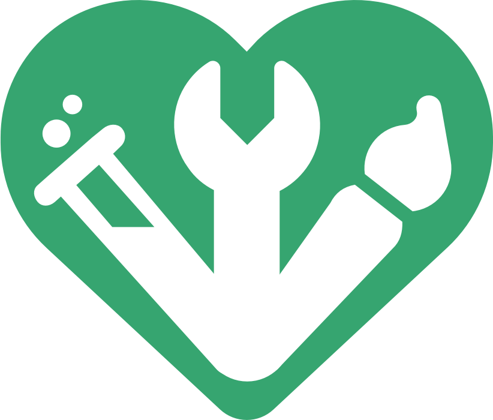

# What is contributionism?

Contributionism is an economic model built around contribution.

The term contributionism has already been used within other books and resources and can often share somewhat similar ideas. These [other definitions and usages of the term contributionism](other-definitions-and-usage-of-the-term-contributionism.md) have been documented separately for clarity and transparency.

Contributionism is focused on the organisation. Contributions represent the beating heart of every organisation.

Under contributionism, contributions should be invited, properly measured and fairly rewarded. Contributions are used to determine how an organisation is owned, governed and incentivised.

Organisations could include small businesses, large corporations, community projects or even local clubs. Any person or group of people that come together around a shared purpose could benefit from adopting contributionist principles in their organisation.

## **Types of contribution**

The following contributions are either essential or often highly valuable to an organisation.

**Labour**

Labour includes any of the work, skills and expertise that is involved with creating and operating an organisation. Labour could be creative, physical, intellectual or social. These four types of labour are covered in more detail below.

**Capital**

Capital investment can be highly beneficial to organisations at different stages of their development. Capital could be used to help start an organisation or it could help with its maintenance and growth. Some common types of capital that can be beneficial for organisations include:

* **Financial capital** - Financial assets such as fiat currencies, gold or cryptocurrencies.
* **Physical capital** - Physical assets such as buildings, machinery, vehicles or electronics.
* **Intellectual capital** - Intellectual assets such as patents, trademarks, copyrights or proprietary technology.
* **Social capital** - Networks, relationships and social structures that can help with facilitating cooperation and economic transactions.

**Consumption**

In a market economy, consumption is the purchasing of goods or services. This is a consumer based contribution. Consumer purchases that generate profit for an organisation are often required for many organisations to survive over the long term. In other economic structures, such as those that are based on gifting, needs or that are access based, consumption is still a form of contribution as the demand for a good or service will still have an influence on determining whether more labour and resources get directed towards certain organisations over others.

**Donation**

People might make donations to certain organisations to help them with achieving their mission and goals. Donations can be an important contribution for sustaining not-for-profit and charity based organisations.

## **Types of labour**

<figure><figcaption></figcaption></figure>

🖌️ **Creative labour**

Involves tasks that require creativity, innovation and artistic expression, such as art, design, writing, entertainment and content creation.

🔧 **Physical labour**

Involves tasks that require physical effort and skills, such as construction, manufacturing, farming, maintenance and transportation.

🧪 **Intellectual labour**

Involves tasks that require mental effort, analytical thinking, problem-solving and specialised knowledge, such as research, analysis, education, professional services and technical work.

❤️ **Social labour**

Involves tasks that require emotional intelligence, empathy or relationship building, such as caregiving, counselling, social work, customer service, community engagement and human interaction.
